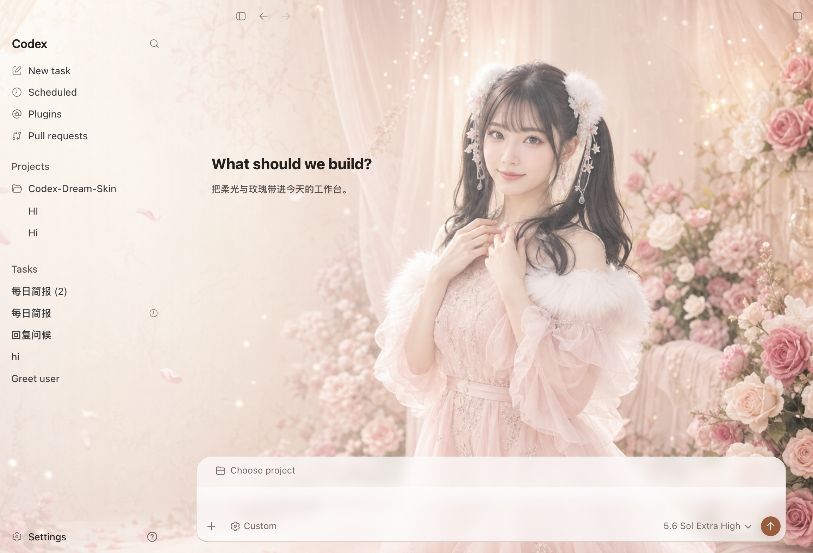
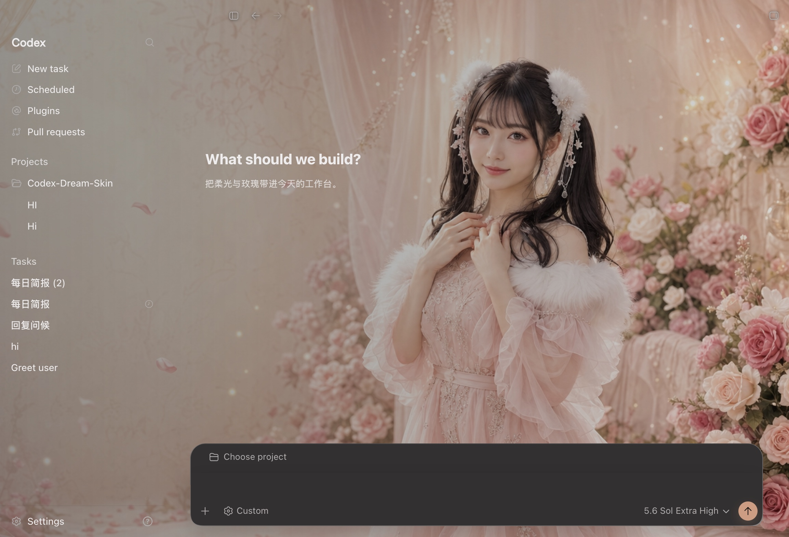

# Codex Dream Skin

  <strong>中文</strong> · <a href="./README.en.md">English</a>

  <strong>给 Codex 桌面端换一张会呼吸的脸。</strong> 
  外部主题 / 换肤工具 · 本机 CDP 注入 · 不改官方安装包

  一张图，一种心情 · 写代码，也要有氛围感

  非 OpenAI 官方产品。不修改 <code>.app</code> / <code>app.asar</code> / WindowsApps。

## 直接安装

普通用户只需先安装并退出一次官方 Codex / ChatGPT，然后从
[GitHub Releases](https://github.com/Fei-Away/Codex-Dream-Skin/releases) 下载：

- macOS：打开 `CodexDreamSkin-vX.Y.Z.dmg`，把 App 拖进 Applications。
- Windows：双击 `CodexDreamSkin-Setup-vX.Y.Z.exe`，按安装向导完成。

不需要 clone 源码、安装 Node.js 或手动运行 `.sh` / `.ps1`。首次未签名放行、更新和卸载步骤见
[macOS 安装说明](./docs/install-macos.md) / [Windows 安装说明](./docs/install-windows.md)。

## 赞助商

  

  <strong>更智能的连接 · 更热爱的创造</strong> 
  热爱驱动 · 无限可能 · Connect AI · Power Creation

  感谢 <a href="https://passion8.cc/register?aff=TuPe"><strong>passion8.cc</strong></a> 赞助本项目。 
  满血 AI 中转：官方模型直连，无降智、无套壳；一行配置接入 Codex / Claude Code / Grok。

  
    换肤与 API 配置互相独立，本项目不会自动改写你的模型供应商设置。
  

## 实测精选预设

### Gothic Void Crusade / 哥特虚空远征

**特别感谢 [@seansong-ideogram](https://github.com/seansong-ideogram) 为社区设计并贡献这套精美、极具氛围感的原创哥特科幻作品。** 它是当前实测精选的第一套预设，也是 macOS 全新安装时默认启用的主题。

   
  真实 Codex 首页注入效果（仅预览）

安装后可直接从 macOS 菜单栏的「已保存主题」切换。

### 桥本有菜 / Arina Hashimoto

下面这套「桥本有菜 / Arina Hashimoto」已经在真实 Codex 首页分别验证浅色和暗色外观。用户提供的源 PNG 为 `1672 × 941`，主题包在保持源图近 16:9 构图的前提下派生导出 `2560 × 1440` JPEG，并不代表增加了源图细节。截图中的侧栏、卡片、项目选择和输入框都是 Codex 原生控件。

   
  浅色 · 真实注入截图（未发送输入已在截图时遮蔽，仅预览）

   
  暗色 · 真实注入截图（未发送输入已在截图时遮蔽，仅预览）

这组人物素材留在源码仓库用于参考与权利核验，不进入公开 DMG / Setup.exe；公开安装包只预置已确认
可分发的 Gothic Void Crusade。普通用户仍可从菜单里的「更换背景图」导入自己有权使用的纯背景，
保存后继续一键切换。

> 可下载的用户源图是 [`docs/images/presets/arina-hashimoto-source.png`](./docs/images/presets/arina-hashimoto-source.png)（`1672 × 941`）；源码参考预设使用 [`macos/presets/preset-arina-hashimoto/background.jpg`](./macos/presets/preset-arina-hashimoto/background.jpg)（规范化派生 `2560 × 1440`）。上面两个效果图包含真实 UI，**只作预览，绝不能当背景导入**。背景为用户提供的 AI 生成示例，不代表 OpenAI/Codex 官方视觉或背书；未确认人物与素材权利前不得把它打进公开安装包。

## 它能做什么

- **真·可交互**：侧栏、建议卡、项目选择、输入框都是原生控件，不是整窗假截图贴上去
- **真背景层**：一张 16:9 纯壁纸连续铺满整窗，首页突出氛围，任务页自动降低干扰
- **可换图**：换一张喜欢的纯背景，自适应焦点、安全区和配色后变成你的主题
- **可存主题**：macOS 菜单栏与 Windows 系统托盘都能保存/切换本地主题
- **可导入主题包**：两端都可直接选择普通 `.zip`，安全校验后加入本地主题库
- **可恢复**：一键还原官方外观
- **相对安全**：本机回环 CDP 注入，不改官方二进制与签名

## 快速开始

### 普通用户：下载安装包

不需要 clone 仓库，也不需要安装 Node.js 或运行 `.sh` / `.ps1`。从
[GitHub Releases](https://github.com/Fei-Away/Codex-Dream-Skin/releases) 下载对应平台的最新安装包，
按平台文档完成一次图形界面安装：

| 平台 | 下载 | 安装说明 |
|------|------|----------|
| macOS | `CodexDreamSkin-vX.Y.Z.dmg` | [`docs/install-macos.md`](./docs/install-macos.md) |
| Windows | `CodexDreamSkin-Setup-vX.Y.Z.exe` | [`docs/install-windows.md`](./docs/install-windows.md) |

安装后从菜单栏（macOS）或系统托盘（Windows）使用。更新时下载新安装包覆盖安装，主题和图片会保留；
未签名的新下载文件在个别系统上仍可能再次出现一次安全提示，文档列出了放行方法。

### 导入下载的主题

在 macOS 菜单栏选择“导入主题 ZIP…”，或在 Windows 托盘选择同名菜单。只支持普通 `.zip`，
不支持 `.dreamskin` 后缀，也不要仅改后缀伪装。正式 Studio 主题包包含 `manifest.json`、
`theme.json` 和恰好一张 `background.webp|jpg|png`；还可包含 `theme.css`、`LICENSE.txt` 和预留的
`manifest.sig`。这些文件可以位于 ZIP 根目录或唯一一层主题目录。导入器会核对适用平台、最低客户端
版本，以及清单中每个负载文件的大小和 SHA-256。`theme.css` 会保留但当前不会执行；`manifest.sig`
当前不参与签名验证。

为兼容本机已有工作流，也接受仅含 `theme.json` 和其引用图片的两文件简化 ZIP；该格式没有正式清单的
完整性与兼容性声明，只应从可信来源使用。压缩包最大 32 MiB、最多 32 个条目、解压后最多 64 MiB。
导入成功后主题只会加入“已保存的主题”，不会自动替换当前主题；相同内容不会重复写入，同 ID 的不同
主题会使用新的安全标识保存。

也可以先手动解压，再把包含 `theme.json` 和背景图的完整主题目录移动到本机主题库：

- macOS：`~/Library/Application Support/CodexDreamSkinStudio/themes/`
- Windows：`%LOCALAPPDATA%\CodexDreamSkin\themes\`

菜单里有“打开主题文件夹”快捷入口。移动后重新打开菜单/托盘即可；不要再套一层目录，也不要放链接、
嵌套压缩包或只有图片而没有 `theme.json` 的文件夹。手动目录不会经过 ZIP 导入器的归档校验，请只使用
可信内容。两端菜单也可直接打开 DreamSkin.cc 的“主题库 Gallery”和“在线 Studio”。

### 开发者：从源码运行

仓库内按平台放了现成脚本（实现细节不同，效果都是「主题化 Codex」）：

| 平台 | 目录 | 入口 |
|------|------|------|
| Apple Silicon / Intel Mac | [`macos/`](./macos/) | 双击 `Install Codex Dream Skin.command` |
| Windows | [`windows/`](./windows/) | `scripts/install-dream-skin.ps1` → `start-dream-skin.ps1` |

更细的说明：

- Mac：[`macos/README.md`](./macos/README.md)
- Windows：[`windows/README.md`](./windows/README.md)
- 路径对照：[`docs/platforms.md`](./docs/platforms.md)
- 可直接复制的参考生图模板：[`docs/reference-background-prompt-guide.md`](./docs/reference-background-prompt-guide.md)
- 八种概念方向详细提示词：[`docs/background-generation-prompts.md`](./docs/background-generation-prompts.md)
- 项目记录：[`docs/PROJECT.md`](./docs/PROJECT.md)

## 反馈与贡献

- **Issue：** 请用 [Issue 模板](./.github/ISSUE_TEMPLATE/)（Bug / 功能）；已关闭空白 Issue。提交前建议先跑 Verify / Restore 自检。
- **PR：** 请按 [PR 模板](./.github/pull_request_template.md) 写清改动，并勾选对应自测（如 `macos/tests/run-tests.sh`、verify / restore）。

## 安全边界

- CDP 只绑 `127.0.0.1`，主题运行期间勿跑来路不明的本机程序
- 不修改官方安装目录与代码签名
- **不会**自动改写 API Key / Base URL；中转与换肤分开

## 许可与声明

- 见 [`macos/LICENSE`](./macos/LICENSE)（MIT）与 [`macos/NOTICE.md`](./macos/NOTICE.md)
- 非 OpenAI 官方产品；Codex 及相关权利归其权利人
- 随仓库预设及效果图中的人物 / IP 素材仅作主题示意；商用或公开再分发请自行确认肖像、素材与商标权利

---

Star 一下，然后挑一张图，把你的 Codex 变成今天想要的样子。
