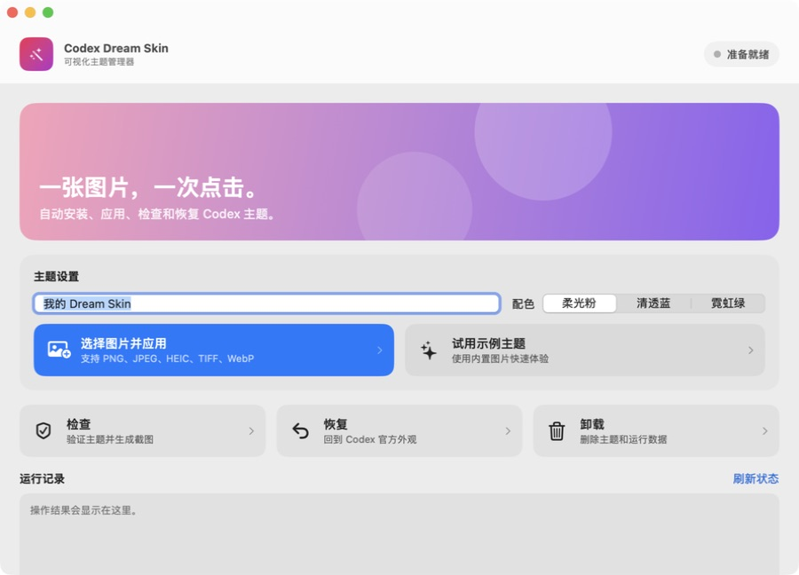

# Codex Dream Skin 可视化管理器

面向 macOS 普通用户的可视化主题管理器。应用内置 Codex Dream Skin Studio 引擎，通过按钮完成安装、选择图片、应用主题、验证、恢复和卸载。



## 功能

- 选择 PNG、JPEG、HEIC、TIFF 或 WebP 图片并应用
- 柔光粉、清透蓝、霓虹绿三套配色
- 一键试用仓库内置示例主题
- 检查主题状态并生成验证截图
- 恢复 Codex 官方外观
- 删除主题引擎、用户图片、状态和日志
- 显示运行状态、进度遮罩、操作日志和危险操作确认

## 从源码构建

```bash
cd macos
./tests/run-tests.sh
./app/build.sh
```

构建产物位于：

- `macos/app/build/Codex Dream Skin.app`
- `macos/app/build/Codex-Dream-Skin-1.0.0.dmg`

构建脚本会直接从当前 `macos/` 目录打包引擎，GUI 与仓库脚本始终保持同一版本。

App Icon 的 1024 px 原图和 `.icns` 位于 `macos/app/Assets/`，构建时会自动写入应用资源。

## 使用

1. 安装并至少启动一次官方 Codex Desktop。
2. 打开 DMG，把 `Codex Dream Skin.app` 拖进“应用程序”。
3. 第一次打开时选择“右键 → 打开”。
4. 选择图片和配色，点击“选择图片并应用”。
5. 暂时不用主题时点击“恢复”；希望删除全部主题数据时点击“卸载”。

应用或恢复主题时，Codex 会自动重启一次。可视化管理器会继续显示操作进度和结果。

## 系统要求

- macOS 13 或更新版本
- 官方 Codex Desktop
- 无需另装 Node.js

## 分发说明

当前构建使用临时签名，可在本机运行。公开分发需要 Apple Developer ID 签名和 Apple 公证，以避免 Gatekeeper 警告。

## 上游与许可

内置引擎来自 `Fei-Away/Codex-Dream-Skin`，依照 MIT License 分发。应用与 OpenAI 无关联，不修改 Codex 官方应用、`app.asar` 或代码签名。
